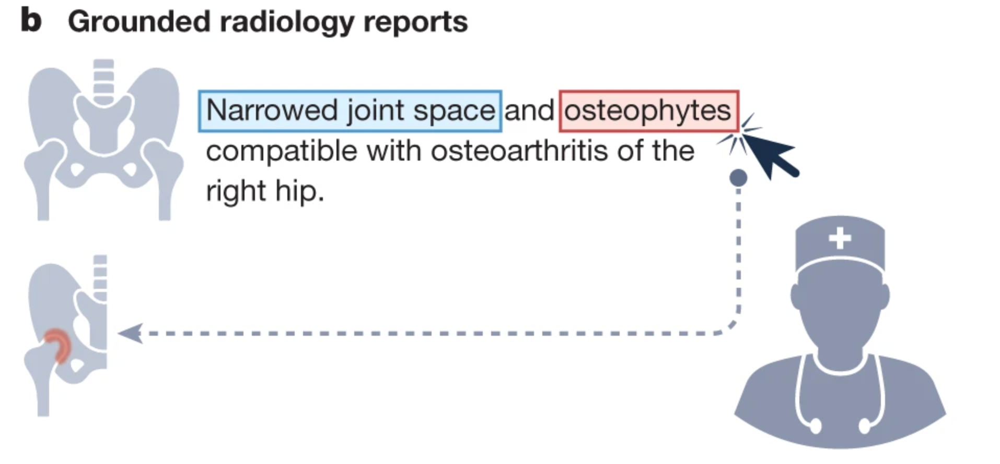

# CXR Agent

ReAct agent for grounded chest X-ray report generation. Claude Sonnet 4.6 orchestrates 12 specialized CXR tools (from 18 defined) via Anthropic native tool-use, with CLEAR concept priors as structured context. Produces FINDINGS + IMPRESSION + GROUNDINGS with bounding boxes and segmentation masks.

## Architecture

```
                          Anthropic API
                              |
                     Claude Sonnet 4.6 (ReAct)
                      /       |        \
                CLEAR prior  Tools(12)  Adaptive Thinking
                (in-process)  (HTTP)    (effort: medium)
                     |
    ┌────────────────┼──────────────────────────┐
    GPU 0            GPU 1                      GPU 2
    CheXagent-2      CheXOne    CheXzero        MedGemma
    :8001 (5 tools)  :8002      :8009            :8010 (2 tools)
                     BiomedParse CXR Foundation  FactCheXcker
                     :8005       :8008           :8007
```

**How it works**: For each CXR image, the agent (1) receives CLEAR concept similarity scores as a structured prior, (2) follows a 6-phase skill workflow calling tools via ReAct to gather evidence, and (3) synthesizes a grounded FINDINGS + IMPRESSION report with bounding boxes linking findings to spatial locations.

## Tools

### Enabled (12 tools across 7 servers)

| Tool | Server | Capability |
|------|--------|------------|
| `chexagent2_report` | :8001 | Free-text CXR report generation |
| `chexagent2_srrg_report` | :8001 | Structured report by anatomy (Lungs, Pleura, CV, Other) |
| `chexagent2_grounding` | :8001 | Bounding boxes for findings, tubes, fractures, devices |
| `chexagent2_classify` | :8001 | View classification, binary disease, disease identification |
| `chexagent2_vqa` | :8001 | Visual question answering on CXR |
| `chexone_report` | :8002 | Report generation with optional reasoning trace |
| `medgemma_report` | :8010 | Report generation (Google MedGemma 4B) |
| `medgemma_vqa` | :8010 | Visual question answering (Google MedGemma 4B) |
| `chexzero_classify` | :8009 | 10-model ensemble CLIP, 14 CheXpert labels |
| `cxr_foundation_classify` | :8008 | Google ELIXR v2 (EfficientNet-L2 + BERT), 14 CheXpert labels |
| `biomedparse_segment` | :8005 | Text-prompted anatomical/pathology segmentation |
| `factchexcker_verify` | :8007 | Verify/correct measurement hallucinations (ETT/carina) |

### Disabled (7 tools)

| Tool | Reason |
|------|--------|
| `medversa_*` (5 tools) | Produces hallucinated outputs |
| `medsam_segment` | Poor segmentation quality on CXR |
| `medsam3_segment` | Replaced by BiomedParse |

## Skill Workflow

The agent follows a 6-phase workflow defined in `skills/grounded_report.md`:

1. **Collect Reports** (3 calls, mandatory) — CheXagent-2, CheXOne, SRRG reports
2. **Screen Pathologies** (2 calls, mandatory) — CheXzero + CXR Foundation 14-label classification
3. **Confirm Findings** (1-3 calls) — Binary confirmation via CheXagent-2 classify/VQA. Include if 2/3 classifiers agree.
4. **Ground Findings** (1-3 calls) — Bounding boxes (phrase grounding) + segmentation (BiomedParse) for confirmed findings
5. **Verify** (1 call, mandatory) — FactCheXcker checks for measurement hallucinations
6. **Write Report** — Synthesize FINDINGS + IMPRESSION + GROUNDINGS in MIMIC-CXR dictation style

## Quick Start

### Prerequisites

- NVIDIA GPUs (tested on 3x A6000, ~48GB each)
- `ANTHROPIC_API_KEY` set in environment
- CLEAR model checkpoint at `../cxr_concept/CheXzero/checkpoints/dinov2-multi-v1.0_vitb/best_model.pt`
- CLEAR concepts at `../cxr_concept/CheXzero/concepts/mimic_concepts.csv`

### 1. Install

```bash
# Main environment (all servers except CheXagent-2)
conda create -n cxr_agent python=3.10 -y
conda activate cxr_agent
pip install -r requirements.txt
pip install qwen-vl-utils  # CheXOne (Qwen2.5-VL)

# CheXagent-2 (requires transformers==4.40.0)
conda create -n cxr_chexagent2 python=3.10 -y
conda activate cxr_chexagent2
pip install -r requirements_chexagent2.txt
```

See `scripts/validate_models/GPU_SERVER_SETUP.md` for full environment setup including external repos (BiomedParse, FactCheXcker).

### 2. Launch Model Servers

```bash
# All servers
bash scripts/launch_servers.sh

# Core only (CheXagent-2 + CheXOne)
bash scripts/launch_servers.sh --only core

# Stop all
bash scripts/launch_servers.sh --stop
```

Additional servers launched manually:
```bash
# CheXzero (GPU 1)
conda activate cxr_agent
CUDA_VISIBLE_DEVICES=1 python servers/chexzero_server.py

# CXR Foundation (GPU 2)
CUDA_VISIBLE_DEVICES=2 python servers/cxr_foundation_server.py

# MedGemma (GPU 2, ~8GB VRAM)
CUDA_VISIBLE_DEVICES=2 python servers/medgemma_server.py
```

Health checks:
```bash
curl http://localhost:8001/health  # CheXagent-2
curl http://localhost:8002/health  # CheXOne
curl http://localhost:8005/health  # BiomedParse
curl http://localhost:8007/health  # FactCheXcker
curl http://localhost:8008/health  # CXR Foundation
curl http://localhost:8009/health  # CheXzero
curl http://localhost:8010/health  # MedGemma
```

### 3. Validate Models

```bash
python scripts/validate_models/validate_all.py
python scripts/validate_models/validate_all.py --only chexagent2 chexone clear
```

### 4. Run the Agent

```bash
# Single image
python scripts/run_agent.py --image /path/to/cxr.png

# Directory of images
python scripts/run_agent.py --image_dir /path/to/images/ --output results/

# With clinical context and prior study
python scripts/run_agent.py --image /path/to/cxr.png \
  --clinical_context context.txt \
  --prior_report prior.txt --prior_image /path/to/prior_cxr.png

# Without CLEAR concept prior
python scripts/run_agent.py --image /path/to/cxr.png --no_clear

# With evolved skill
python scripts/run_agent.py --image /path/to/cxr.png --skill_path skills/evolved_v2.md

# Custom config
python scripts/run_agent.py --image /path/to/cxr.png --config configs/config_grounded.yaml
```

Output: JSON with report, grounding, trajectory (tool calls + reasoning), and token usage saved to `results/`.

## MIMIC-CXR Evaluation

`scripts/eval_mimic.py` provides a full evaluation pipeline with 5 baselines and the agent.

### Modes

| Mode | Description |
|------|-------------|
| `prepare` | Build `test_set.json` from MIMIC-CXR-JPG metadata + reports + clinical context |
| `chexagent2` | CheXagent-2 direct baseline (no agent, no CLEAR) |
| `chexone` | CheXOne direct baseline |
| `medgemma` | MedGemma direct baseline |
| `medversa` | MedVersa direct baseline |
| `sonnet` | Claude Sonnet 4.6 vision-only (no tools, no CLEAR) |
| `agent` | Full CXR Agent (CLEAR + 12 tools + ReAct + skill workflow) |
| `score` | Compute metrics on all prediction files |
| `compare` | Side-by-side metric table across all modes |

### Run Evaluation

```bash
# 1. Prepare test set (enriches with clinical context, prior studies, labs)
python scripts/eval_mimic.py --mode prepare \
  --mimic_cxr_dir /path/to/mimic-cxr-jpg/2.0.0 \
  --mimic_iv_dir /path/to/mimiciv/3.1

# 2. Run baselines
python scripts/eval_mimic.py --mode chexagent2
python scripts/eval_mimic.py --mode chexone
python scripts/eval_mimic.py --mode medgemma
python scripts/eval_mimic.py --mode sonnet

# 3. Run agent
python scripts/eval_mimic.py --mode agent --config configs/config_grounded.yaml

# 4. Score (uses CXR-Report-Metric: RadCliQ-v1, RadGraph-F1, SembScore, BERTScore, BLEU-2)
python scripts/eval_mimic.py --mode score --eval_sections findings  # or impression, full

# 5. Compare all modes
python scripts/eval_mimic.py --mode compare
```

### Metrics

Scored via [CXR-Report-Metric](https://github.com/rajpurkarlab/CXR-Report-Metric):
- **RadCliQ-v1** — composite radiology clinical quality (primary metric)
- **RadGraph-F1** — semantic entity/relation correctness
- **SembScore** — semantic embedding similarity
- **BERTScore** — contextual token matching
- **BLEU-2** — bigram overlap

Additional metrics via evotest: RaTEScore, GREEN.

### Convert for ReXrank

```bash
python scripts/convert_to_rexrank.py --predictions results/predictions_agent.json \
  --test_set results/test_set.json --output results/rexrank/
```

## Skill Evolution (Evotest)

Tree-based evolutionary optimization of the skill prompt, using 1/RadCliQ-v1 as reward.

```bash
# Train on validation set (30 patients, 10 episodes)
python scripts/evotest_cxr.py --mode train --config configs/config_grounded.yaml

# Test best evolved skill on test set (100 patients)
python scripts/evotest_cxr.py --mode test

# Resume from checkpoint
python scripts/evotest_cxr.py --mode train --resume
```

## Configuration

Three configs for different setups:

| Config | Tools | Iterations | Use Case |
|--------|-------|------------|----------|
| `config_grounded.yaml` | 12 | 15 | Full grounded pipeline (primary) |
| `config_core.yaml` | 6 | 10 | Minimal: CheXagent-2 + CheXOne only |

`configs/config_grounded.yaml`:
```yaml
agent:
  model: "claude-sonnet-4-6"
  max_iterations: 15         # 6-phase workflow needs 8-12 tool calls
  max_tokens: 4096           # per response (16000 when thinking is on)
  temperature: 0.0           # ignored when thinking is enabled
  reasoning_effort: "medium" # adaptive thinking

clear:
  top_k: 20                  # concepts injected as prior

tools:
  chexagent2:
    enabled: true
    endpoint: "http://localhost:8001"
  # ... (12 enabled, 6 disabled)
```

## CLEAR Concept Prior

CLEAR (CLIP + DinoV2 dual-encoder) scores each CXR against 368K MIMIC-CXR observations via cosine similarity. The top-K concepts are injected into the system prompt as structured context, giving the agent an image-specific prior before any tool calls.

- Model: DinoV2-ViT-B fine-tuned with CLIP objective
- Vocabulary: 368K observations from MIMIC-CXR reports
- Cache: Embeddings cached to `cache/clear/` (disk) + in-memory
- Tool cache: All tool responses cached to `cache/tools/` (except FactCheXcker)

## Conda Environments

| Env | Python | Purpose |
|-----|--------|---------|
| `cxr_agent` | 3.10 | Main agent + most servers |
| `cxr_chexagent2` | 3.10 | CheXagent-2 only (transformers==4.40.0) |
| `cxr_medversa` | 3.10 | MedVersa only (transformers==4.28.1, disabled) |

## GPU Allocation

| GPU | Servers | VRAM |
|-----|---------|------|
| 0 | CheXagent-2 (:8001) | ~18 GB |
| 1 | CheXOne (:8002) + CheXzero (:8009) + BiomedParse (:8005) | ~15 GB |
| 2 | MedGemma (:8010, ~8 GB) + FactCheXcker (:8007) + CXR Foundation (:8008) | ~15 GB |

CLEAR runs in-process on the agent's device (CPU or GPU, ~2 GB).

## Project Structure

```
CXR_Agent/
├── agent/
│   ├── react_agent.py          # ReAct loop, Anthropic API, adaptive thinking
│   └── prompts.py              # System prompt, CLEAR template, skill injection
├── clear/
│   ├── concept_scorer.py       # CLEAR: CLIP + DinoV2 concept scoring
│   ├── clip_model.py           # CLIP architecture
│   └── clip_tokenizer.py       # CLIP text tokenizer
├── tools/
│   ├── base.py                 # BaseCXRTool interface + disk/memory cache
│   ├── chexagent2.py           # 5 tools → :8001
│   ├── chexone.py              # 1 tool  → :8002
│   ├── medgemma.py             # 2 tools → :8010
│   ├── chexzero.py             # 1 tool  → :8009
│   ├── cxr_foundation.py       # 1 tool  → :8008
│   ├── biomedparse.py          # 1 tool  → :8005
│   ├── factchexcker.py         # 1 tool  → :8007
│   ├── medversa.py             # 5 tools → :8004 (disabled)
│   ├── medsam.py               # 1 tool  → :8009 (disabled)
│   └── medsam3.py              # 1 tool  → :8006 (disabled)
├── servers/
│   ├── chexagent2_server.py    # Multi-task: report, srrg, classify, ground, vqa
│   ├── chexone_server.py       # Report with optional reasoning
│   ├── medgemma_server.py      # VQA + report generation
│   ├── chexzero_server.py      # 10-model ensemble classification
│   ├── cxr_foundation_server.py # ELIXR v2 classification
│   ├── biomedparse_server.py   # Text-prompted segmentation
│   ├── factchexcker_server.py  # Measurement verification
│   ├── medversa_server.py      # Multi-task (disabled)
│   ├── medsam_server.py        # Bbox-prompted SAM (disabled)
│   └── medsam3_server.py       # Text-guided SAM (disabled)
├── skills/
│   └── grounded_report.md      # 6-phase grounded report workflow
├── configs/
│   ├── config_grounded.yaml    # Full 12-tool config (primary)
│   └── config_core.yaml        # Minimal 6-tool config
├── scripts/
│   ├── run_agent.py            # Main entry point
│   ├── eval_mimic.py           # MIMIC-CXR evaluation (9 modes)
│   ├── prepare_mimic_studies.py # Enrich MIMIC-CXR with clinical context
│   ├── score_full_metrics.py   # CXR-Report-Metric scoring
│   ├── convert_to_rexrank.py   # Convert to ReXrank submission format
│   ├── evotest_cxr.py          # Skill evolution via tree search
│   ├── launch_servers.sh       # Launch/stop model servers
│   ├── precompute_concepts.py  # Batch CLEAR embedding precomputation
│   └── validate_models/        # Per-model validation scripts
├── cache/
│   ├── tools/                  # Tool response cache (disk)
│   └── clear/                  # CLEAR embedding cache (.npy)
└── trajectories/               # Saved agent trajectories (JSON)
```

## Grounded Report Output

```
FINDINGS:
The heart is mildly enlarged. There is a small left pleural effusion.
The lungs are clear. There is no pneumothorax.

IMPRESSION:
Mild cardiomegaly with small left pleural effusion.

GROUNDINGS:
[
  {"finding": "cardiomegaly", "bbox": [0.25, 0.30, 0.75, 0.85], "tool": "chexagent2_grounding"},
  {"finding": "left pleural effusion", "bbox": [0.55, 0.70, 0.95, 0.98], "tool": "biomedparse_segment", "coverage_pct": 4.2}
]
```


